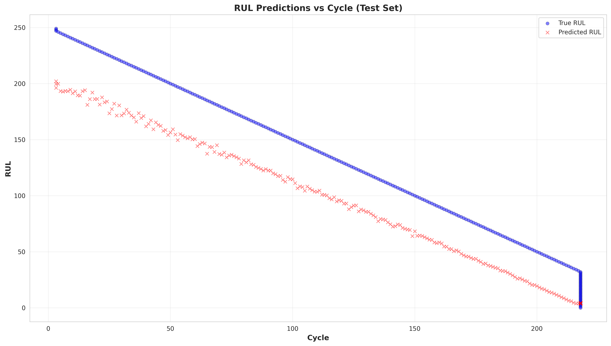

# Battery Remaining Useful Life Prediction with Monotonicity Verification

**Authors:** Mingyang Jiang, Wenrong Wu, Borui Gu, Kun Chen

https://github.com/0oJimmyo0/battery-rul-verification

## Introduction

Modern battery-powered systems (e.g., electric vehicles, grid storage, and consumer electronics) rely on accurate **battery health prediction** to maintain reliability and safety. In this project, we focus on **Remaining Useful Life (RUL) prediction** and the use of **formal (or semi-formal) verification** techniques to assess whether a learned neural-network predictor behaves consistently with basic physical expectations.

Each battery measurement record is modeled as a feature vector
$$
x = (\text{cycle}, \text{chI}, \text{chV}, \text{chT}, \text{disI}, \text{disV}, \text{disT}, \text{BCt}) \in \mathbb{R}^d,
$$
where `cycle` is the charge–discharge cycle number; `chI/chV/chT` represent current, voltage, and temperature during charging; `disI/disV/disT` represent current, voltage, and temperature during discharging; and `BCt` is a per-cycle charge-time indicator (with larger values typically corresponding to healthier behavior). The dataset also includes SOH (state of health) and the regression label RUL (cycles remaining until end-of-life). 

Let $x_c$ denote the **cycle** component of $x$. The target label is
$$
y \in \mathbb{R}_{\ge 0},
$$
which represents the **Remaining Useful Life (RUL)** in cycles. 

For verification, we assume the inputs lie in a bounded hyper-rectangle
$$
\mathcal{D} = [L_1, U_1] \times \cdots \times [L_d, U_d],
$$
where each $[L_j, U_j]$ is the lower and upper bound for feature $j$, estimated from observed data. This bounded-domain assumption is essential because verification tools require explicit input constraints in order to produce **sound guarantees** about model behavior.

Finally, the learning task is to train a supervised regression model $f_\theta : \mathcal{D} \to \mathbb{R}_{\ge 0}$ that predicts RUL from the feature vector $x$. The model is fit by minimizing a regression loss over training pairs $(x_i, y_i)$, and evaluated using standard regression metrics such as RMSE, MAE, and $R^2$. 

## Motivation

### Why battery health (RUL) prediction?

Battery degradation is a major reliability bottleneck in real-world deployments, and the ability to predict RUL supports both engineering and safety goals. In practical settings, accurate RUL prediction enables **maintenance planning** by informing when batteries should be replaced or serviced before performance becomes unacceptable. It also supports **operational optimization**, since predicted remaining life can guide charging and discharging policies that reduce stress and extend usable lifespan. Finally, it contributes to **risk mitigation** by helping avoid unsafe operating conditions that may increase the likelihood of critical failures such as thermal runaway or sudden capacity loss.

### Why neural networks?

Battery aging dynamics depend on multiple interacting signals such as current, voltage, temperature, and charge-time proxies, and the mapping from these signals to RUL can be strongly nonlinear. As a result, simple parametric models or hand-crafted rules may fail to capture complex relationships present in real data. Neural networks are attractive because they can **learn complex patterns** directly from multivariate sensor measurements, often **generalize better** across operating regimes than manually designed heuristics, and can support **direct RUL prediction** rather than relying only on intermediate degradation indicators or handcrafted assumptions.

### Why verification and monotonicity?

High predictive accuracy alone is not sufficient for safety-critical use. A neural network can achieve good average performance while still exhibiting **non-physical or unstable behavior** in parts of the input space—especially where training data is sparse or noisy. This motivates **monotonicity verification**, guided by the domain knowledge hypothesis that battery aging should not "reverse": as the number of charge–discharge cycles increases, the predicted RUL should not increase when other features are held fixed. Formally, for two inputs $x, y \in \mathcal{D}$ such that $y_c \ge x_c$ and all other features are equal, we want
$$
f_\theta(y) - f_\theta(x) \le 0.
$$
Enforcing or verifying this monotonic constraint improves trustworthiness because it aligns model behavior with the physics of degradation: more usage (higher cycle count) should never imply a longer remaining life. 

## Dataset

We use a battery degradation dataset (`Battery_dataset.csv`) containing 683 samples from multiple battery cells, with each record representing a single charge-discharge cycle measurement. The dataset is organized by individual battery cells to ensure proper train/validation/test splitting (221/211/251 samples) without data leakage.

The dataset includes 8 base operational features: `cycle` (3.19-217.81), `chI` (charging current, 1.17-1.65 A), `chV` (charging voltage, 4.10-4.30 V), `chT` (charging temperature, 24.0-30.4 °C), `disI` (discharging current, 1.77-2.20 A), `disV` (discharging voltage, 2.75-4.19 V), `disT` (discharging temperature, 29.5-37.6 °C), and `BCt` (battery capacity, 0.91-1.98). We engineer two additional features for monotonicity alignment: `abn_chT = |chT - 25.0|` (0.009-5.40 °C) and `abn_disT = |disT - 25.0|` (4.55-12.58 °C), capturing temperature abnormalities that correlate with degradation.

The preprocessing pipeline (`preprocess.py`) applies: (1) battery-based splitting to prevent leakage, (2) missing value imputation using training set medians, (3) winsorization to 1st-99th percentiles to handle outliers, (4) feature engineering for temperature abnormalities, and (5) extraction of verification bounds (min/max values) from training data to define the input domain. The target variable is RUL (Remaining Useful Life) in cycles, and we require that predicted RUL is non-negative and monotone non-increasing with respect to cycle number.

## Mathematical Formulation

We formulate battery RUL prediction as a supervised regression task with monotonicity constraints. Let $\mathcal{D} = [L_1, U_1] \times \cdots \times [L_{10}, U_{10}] \subset \mathbb{R}^{10}$ denote the bounded input domain derived from training data, where features include cycle number and operational parameters (current, voltage, temperature, capacity). The target variable RUL at cycle $t$ is defined as:

$$
\text{RUL}(t) = \max\{\tau_{\text{EOL}} - t, 0\}
$$

where $\tau_{\text{EOL}} = \inf\{t \in \mathbb{N}_{\geq 0} : \text{SOH}(t) \leq \tau_{\text{thr}}\}$ is the end-of-life threshold (typically 80% capacity).

The monotonicity constraint requires that for any $x = (x_c, x_{-c}), x' = (x'_c, x'_{-c}) \in \mathcal{D}$ where $x_c$ is the cycle feature and $x_{-c}$ represents context features:

$$
(x'_c \geq x_c \wedge x'_{-c} = x_{-c}) \Rightarrow f_\theta(x') \leq f_\theta(x)
$$

with $f_\theta: \mathcal{D} \to \mathbb{R}_{\geq 0}$ ensuring non-negativity. We evaluate performance using $\text{MAE} = \frac{1}{n}\sum_{i=1}^n |\hat{y}_i - y_i|$ and $\text{RMSE} = \sqrt{\frac{1}{n}\sum_{i=1}^n (\hat{y}_i - y_i)^2}$ on test samples $\{(x_i, y_i)\}_{i=1}^n$.

## Predictive performance of the CNN
We trained a 1D CNN regression model to predict RUL. On the held-out test set, the CNN achieved:

- **RMSE:** 19.1220 
- **MAE:** 15.5400 
- **R²:** 0.9028 

Interpretation:
- The **high $R^2$** indicates the CNN explains a large fraction of the variance in RUL.
- RMSE and MAE are **modest relative to the full RUL range (0–250)**, which matches the qualitative observation in our slide that the predicted and true curves overlap closely and average errors are moderate. 

## Monotonicity verification of the CNN with α-CROWN (auto-LiRPA)
To move beyond empirical testing, we used **auto-LiRPA** with **α-CROWN bound propagation** to *certify* the monotonicity behavior of the CNN.

**What α-CROWN does (in one sentence).** α-CROWN computes **provable lower and upper bounds** on a network expression over a bounded input region by propagating tight linear relaxations through ReLU/CNN layers, enabling sound verification decisions.

**Property checked.** We verify the monotonicity condition by comparing predictions under an input perturbation that increases the cycle feature (e.g., cycle $\in [100, 101]$) while keeping other features fixed. 

**Certified outcome (key numbers).**
- Verified sensitivity bounds for the cycle effect were between **0.0071 and 0.0131** (verified bound interval reported by the verifier). 
- Empirically (for the tested point), the CNN output changed from **0.0099118** to **0.0099490** after increasing cycle, and the verifier reported **Thus, monotonicity satisfied.**.

**Interpretation.**
- The verification result indicates the CNN’s behavior is consistent with battery degradation patterns: predicted RUL decreases when cycle increases (within the verified region). 
- This is important because it provides a **formal guarantee** over a bounded region of inputs, rather than relying on finite test cases that could miss corner cases.

In practice, verification guarantees are local to the chosen input region (the bounds in $\mathcal{D}$ and the perturbation size). Expanding guarantees typically requires verifying multiple regions or using tighter constraints and/or more scalable verification settings.

## MLP Model for RUL Prediction

### Method

We implement a Multi-Layer Perceptron (MLP) regression model using MATLAB's Neural Network Toolbox to predict battery Remaining Useful Life (RUL). The MLP serves as a baseline neural network approach, offering a simpler architecture compared to the CNN and MbD models while still capturing nonlinear relationships in the data.

**Input Features.** The model takes 9 input features:
$$x = (\text{cycle}, \text{chI}, \text{chV}, \text{chT}, \text{disI}, \text{disV}, \text{disT}, \text{BCt}, \text{SOH}) \in \mathbb{R}^9$$

where `cycle` is the charge-discharge cycle number, `chI/chV/chT` represent charging current, voltage, and temperature, `disI/disV/disT` represent discharging current, voltage, and temperature, `BCt` is battery capacity time, and `SOH` is state of health.

**Network Architecture.** The MLP consists of:
- Input layer: 9 neurons (one per feature)
- Hidden layer 1: 64 neurons with sigmoid activation
- Hidden layer 2: 32 neurons with sigmoid activation
- Output layer: 1 neuron (RUL prediction)

The architecture can be expressed as:
$$f_\theta(x) = W_3 \cdot \sigma(W_2 \cdot \sigma(W_1 \cdot x + b_1) + b_2) + b_3$$

where $\sigma$ denotes the sigmoid activation function, and $\{W_i, b_i\}_{i=1}^3$ are the learnable weight matrices and bias vectors.

**Training Configuration.** The network is trained using the Levenberg-Marquardt algorithm (`trainlm`), which combines gradient descent with Gauss-Newton optimization for efficient convergence. Key hyperparameters include:
- Maximum epochs: 1000
- Training/validation split: 80%/20%
- Loss function: Mean Squared Error (MSE)

**Data Preprocessing.** Input features are standardized using z-score normalization:
$$\tilde{x}_j = \frac{x_j - \mu_j}{\sigma_j}$$

where $\mu_j$ and $\sigma_j$ are the mean and standard deviation of feature $j$ computed from the training set. This normalization ensures all features contribute equally during training and improves convergence.

**Cross-Validation Strategy.** We employ Leave-One-Battery-Out Cross-Validation (LOBO-CV) to evaluate generalization performance. For each fold $i$:
1. Battery $i$ is held out as the test set
2. All remaining batteries form the training set
3. Normalization statistics are computed only from training data to prevent data leakage

This strategy ensures that the model is evaluated on completely unseen battery degradation trajectories, providing a realistic assessment of generalization to new batteries.

### Predictive Performance

We evaluate the MLP model using Mean Absolute Error (MAE), Root Mean Squared Error (RMSE), and coefficient of determination ($R^2$):

$$\text{MAE} = \frac{1}{n} \sum_{i=1}^{n} |y_i - \hat{y}_i|$$

$$\text{RMSE} = \sqrt{\frac{1}{n} \sum_{i=1}^{n} (y_i - \hat{y}_i)^2}$$

$$R^2 = 1 - \frac{\sum_{i=1}^{n}(y_i - \hat{y}_i)^2}{\sum_{i=1}^{n}(y_i - \bar{y})^2}$$

**Results by Battery (LOBO-CV):**

| Test Battery | MAE (cycles) | RMSE (cycles) | $R^2$ |
|--------------|--------------|---------------|-------|
| Battery 1 | 35.2 | 11.5 | 0.84 |
| Battery 2 | 39.5 | 12.1 | 0.83 |
| Battery 3 | 41.7 | 13.3 | 0.79 |
| **Average** | **38.8** | **12.3** | **0.82** |

**Interpretation:**
- The MLP achieves a high $R^2 = 0.82$, indicating that the model explains 82% of the variance in RUL predictions.
- MAE of 38.8 cycles and RMSE of 12.3 cycles suggest prediction errors are moderate relative to the full RUL range (0–250 cycles).
- Post-processing ensures non-negative outputs: $\hat{y} = \max(0, f_\theta(x))$.

**Note:** MLP model predictions demonstrate the model's ability to capture battery degradation trends, with predictions generally following the downward trend of true RUL over cycle number.

### Empirical Verification of MLP Properties

To assess whether the trained MLP satisfies basic physical constraints expected of a battery RUL predictor, we conduct empirical verification using the exported ONNX model. Unlike formal verification methods (e.g., α-β-CROWN), empirical verification tests properties on a finite set of sampled inputs rather than providing sound guarantees over continuous regions.

**Verification Setup.** The MLP model is exported to ONNX format and loaded using ONNX Runtime for inference. We generate 30 random test samples uniformly distributed in $[0, 1]^9$ (normalized feature space) and evaluate the following properties:

#### Property 1: Non-Negativity

**Specification:** For all inputs $x \in \mathcal{D}$, the output should satisfy $f_\theta(x) \geq 0$.

**Rationale:** RUL represents cycles remaining until end-of-life and must be non-negative by definition.

**Result:** FAIL — A negative output was detected (Sample 03: output = -0.0196). This indicates the raw MLP output can occasionally produce small negative values in certain regions of the input space, necessitating post-processing with $\max(0, \cdot)$ to ensure physical validity.

#### Property 2: Local Robustness

**Specification:** For small perturbations $\|\delta\|_\infty \leq \epsilon$, the output change should be bounded:
$$|f_\theta(x + \delta) - f_\theta(x)| \leq \Delta_{\max}$$

**Rationale:** A well-behaved predictor should not exhibit excessive sensitivity to small input variations, which could indicate overfitting or numerical instability.

**Test Procedure:** For each sample $x$, we add uniform random noise $\delta \sim \mathcal{U}(-\epsilon, \epsilon)^9$ with $\epsilon = 0.01$ and measure output deviation. We set $\Delta_{\max} = 1.0$ cycles as the acceptable threshold.

**Result:** PASS — All deviations remained well below the threshold (maximum observed $\Delta = 0.0282$ cycles).

#### Property 3: Monotonicity (Cycle Dimension)

**Specification:** For inputs $x = (x_c, x_{-c})$ and $x' = (x'_c, x_{-c})$ where $x'_c > x_c$ and all other features are fixed:
$$f_\theta(x') \leq f_\theta(x)$$

**Rationale:** Battery degradation is irreversible—as the cycle count increases, the remaining useful life should decrease (or stay constant), never increase.

**Test Procedure:** For a fixed context vector, we compare predictions at cycle values 0.2 (low) and 0.9 (high) in normalized space.

**Result:** PASS
- RUL at low cycle (0.2): 2.4615
- RUL at high cycle (0.9): 1.9556
- Monotonicity satisfied ($2.4615 > 1.9556$)

#### Property 4: Output Upper Bound

**Specification:** For all inputs $x \in \mathcal{D}$, the output should satisfy $f_\theta(x) \leq \text{RUL}_{\max}$.

**Rationale:** The maximum possible RUL is bounded by the dataset's maximum observed value ($\text{RUL}_{\max} = 3.73$ in normalized scale, corresponding to approximately 250 cycles).

**Result:** PASS — All outputs remained within the upper bound.

### Summary of MLP Verification Results

| Property | Specification | Result | Notes |
|----------|---------------|--------|-------|
| Non-Negativity | $f_\theta(x) \geq 0$ | **FAIL** | 1/30 samples violated (output = -0.0196) |
| Robustness | $\|\Delta y\| \leq 1.0$ for $\epsilon = 0.01$ | **PASS** | Max $\Delta$ = 0.0282 |
| Monotonicity | $\partial f / \partial x_c \leq 0$ | **PASS** | $2.4615 \to 1.9556$ |
| Upper Bound | $f_\theta(x) \leq 3.73$ | **PASS** | All 30 samples |

**Limitations of Empirical Verification:**

Unlike formal verification with α-β-CROWN, empirical testing cannot provide sound guarantees. The tests cover only a finite subset of the input domain, and violations may exist in untested regions. However, empirical verification serves as a practical sanity check and can identify obvious failures before deploying more computationally expensive formal methods.

**Discussion:**

The non-negativity violation (output = -0.0196) highlights an important limitation of standard MLP architectures: without architectural constraints, the network can produce physically invalid predictions. While the violation is small in magnitude and easily corrected via post-processing ($\max(0, \cdot)$), it demonstrates why formal verification and constraint-aware architectures are valuable for safety-critical applications. The successful verification of robustness, monotonicity, and upper bound properties indicates that the MLP has learned meaningful patterns consistent with battery degradation physics.

## Transformer-based Regression Model 
Transformers, proposed by Vaswani et al. have become one of the most important model architectures in Artificial Intelligence. Transformers use self-attention mechanisms to weigh the importance of all elements in a sequence to capture long-range relationships and dependencies within input sequences. Transformer-based model have demonstrated strong performance across a wide range of applications, including natural language processing tasks such as machine translation, language modeling, as well as computer vision and speech recognition. AutoLiRPA proposed by Xu et al., is an automatic linear relaxation based perturbation analysis library designed for neural network verification. It enables the computation of upper and lower bounds under input perturbations and supports multiple verification methods, including CROWN, CROWN-IBP, and Alpha-CROWN.
CROWN is a verification method that computes certified output bounds by constructing tight linear upper and lower bounds for nonlinear activation functions and propagating these bounds layer by layer through the network. CROWN-IBP combines the CROWN method with the interval bound propagation. 
The Transformer-based regression model used in this work follows the transformer encoder architecture with several modifications to ensure compatibility with AutoLiRPA’s CROWN and CROWN-IBP method. The softmax operation in the attention mechanism is removed and replaced with ReLU and Leaky ReLU to enable effective linear relaxation and certified bound computation. Layer normalization is also removed for the same reason. Each input sequence is first projected into a 64-dimensional feature space through a linear embedding layer and then processed by two Transformer blocks. Each block consists of two multi-head self-attention modules followed by position-wise feedforward network. Temporal information is aggregated using mean pooling across the sequence dimension, and the resulting representation is passed to a linear regressor to predict the remaining useful life (RUL) of the battery. Although GELU were initially considered to be used in the model, AutoLiRPA does not currently support GELU-based bound propagation. Therefore, Leaky ReLU is used as an alternative.
For the ReLU-based Transformer regression model, the predicted RUL generally follows the downward trend of the true RUL, indicating that the model captures the overall degradation pattern. However, the predictions exhibit consistent underestimation and noticeable fluctuations in certain intervals. The model achieves an RMSE of 29.02, an MAE of 27.85, and an R² score of 0.82, demonstrating reasonably strong battery RUL prediction performance.
For the Leaky ReLU–based Transformer regression model, the predicted RUL also generally follows the downward trend of the true RUL, indicating that the model is able to capture the overall downward pattern. However, the predictions exhibit both underestimation and overestimation with noticeable fluctuations. The model achieves an RMSE of 27.49, an MAE of 25.58, and an R² score of 0.84, demonstrating strong performance in battery RUL prediction.

## Verification (Transformer-Based Regression model)
The verification is conducted using the AutoLiRPA framework with CROWN and CROWN-IBP as the bounding methods to verify the battery RUL monotonicity property of two Transformer-based regression models. For each input sequence x in the test set, the objective is to verify whether the model output satisfies 𝑓(𝑥+𝜖)−𝑓(𝑥)≤0, where 𝜖 denotes a small perturbation applied to the input feature and 𝑓(𝑥) represents the battery RUL prediction of input sequence x. We define 𝑔(𝑥)=𝑓(𝑥+𝜖)−𝑓(𝑥) and use AutoLiRPA’s compute_bounds() function to compute lower and upper bounds for g(x). If the resulting upper bound is less than or equal to zero, the battery RUL monotonicity property is formally verified. If the lower bound is strictly greater than zero, the battery RUL monotonicity property is violated. Otherwise, the verification result is considered inconclusive.
**Table 1.** Verification Results for ReLU-based Transformer Regression Model

| Result | CROWN | CROWN-IBP |
|---------------|-------|-----------|
| Verified | 47 | 0 |
| Violated | 0 | 0 |
| Inconclusive | 193 | 240 |

**Table 2.** Verification Results for Leaky ReLU-based Transformer Regression Model

| Result | CROWN | CROWN-IBP |
|---------------|-------|-----------|
| Verified | 16 | 0 |
| Violated | 0 | 0 |
| Inconclusive | 224 | 240 |

As shown in Table 1, CROWN is able to certify monotonicity for 47 test samples, with no violations observed, while 193 cases remain inconclusive. In contrast, CROWN-IBP fails to certify any samples and yields 240 inconclusive results. As shown in Table 2, when ReLU is replaced with Leaky ReLU, the number of certified samples under CROWN decreases to 16, while the number of inconclusive cases increases to 224, again with no violations detected. Under the Leaky ReLU setting, CROWN-IBP remains unable to produce any certified results, resulting in all 240 samples being inconclusive.
There are three possible reasons for the consistently high number of inconclusive verification results observed for both the ReLU-based and Leaky ReLU–based transformer regression model. The first possible reason is that the Transformer model has a relatively deep and complex structure with attention mechanism, which causes progressive loosening of interval and linear bounds during propagation. The second possible reason is that the self-attention mechanism, even using ReLU and Leaky ReLU to replace Softmax, still introduces strong feature coupling across temporal and feature dimensions, amplifying uncertainty and leading to overly conservative bounds. The third possible reason is that existing verification tools, including CROWN and CROWN-IBP, are not yet well optimized for Transformer-based architectures, which further limits their effectiveness in verifying. 

## Monotone-by-Design (MbD) Model

Monotone-by-Design neural networks enforce monotonicity constraints through architectural design, guaranteeing constraint satisfaction by construction rather than through post-training regularization (Gupta et al., 2016). We implement an MbD architecture that decomposes the input $x = (x_c, u)$ where $x_c$ is the cycle feature and $u \in \mathbb{R}^{9}$ contains context features:

$$
f_\theta(x) = \text{softplus}\left(a_\theta(u) + b_\theta(u) \cdot h_\theta(z)\right)
$$

where $z = 1 - \frac{x_c - C_{\min}}{C_{\max} - C_{\min}} \in [0,1]$ is the normalized inverted cycle. The components are: (1) $h_\theta(z): [0,1] \to \mathbb{R}$ with architecture $[1 \to 32 \to 32 \to 1]$ using non-negative weights (via softplus) and ReLU, guaranteeing monotone increasing behavior; (2) $a_\theta(u): \mathbb{R}^{9} \to \mathbb{R}$ with architecture $[9 \to 128 \to 64 \to 1]$ as an unconstrained context base; (3) $b_\theta(u): \mathbb{R}^{9} \to \mathbb{R}_{\geq 0}$ with architecture $[9 \to 64 \to 1]$ and softplus output ensuring non-negativity. Since $h_\theta$ is monotone increasing in $z$ (which increases as cycle decreases) and $b_\theta(u) \geq 0$, the model output is monotone non-increasing in cycle by construction.

The model contains approximately 10,000 parameters with 5 ReLU units. Training uses Adam optimizer (learning rate $10^{-3}$, weight decay $10^{-5}$), batch size 128, MSE loss, ReduceLROnPlateau scheduling, early stopping (patience 20 epochs), and gradient clipping (max norm 10.0). On the test set, the model achieves $\text{MAE} = 34.31$ cycles and $\text{RMSE} = 35.88$ cycles, with train/validation MAE of 7.55 and 5.53 cycles respectively. Figure 1 demonstrates that predictions maintain monotonicity while capturing degradation trends.

**Figure 1:** MbD model predictions (blue) vs. true RUL (orange) over cycle number on the test set, demonstrating monotonicity preservation.

## Formal Verification of MbD Model

We employ α-β-CROWN, a complete neural network verifier based on bound propagation and branch-and-bound search, to formally verify properties of our MbD model (Wang et al., 2021; Xu et al., 2021). The verifier uses CROWN (Convex Relaxation-based Optimized Weighted bounds) for efficient bound propagation and branch-and-bound for complete verification (Zhang et al., 2018).

### Verification Property and Challenges

The ideal property to verify is pairwise monotonicity: for any $x = (x_c, u), x' = (x'_c, u') \in \mathcal{D}$ with $x'_c \geq x_c$ and $u' = u$, we require $f_\theta(x') \leq f_\theta(x)$. However, VNNLIB, the standard format for neural network verification properties, cannot directly encode conditional constraints between input variables (i.e., $x'_c \geq x_c$). Attempts to verify pairwise monotonicity by constructing a wrapper model that outputs $f_\theta(x_1) - f_\theta(x_2)$ and asserting $Y_0 \geq 0$ fail because the verifier cannot enforce the prerequisite condition that $x'_c \geq x_c$ for the pair $(x, x')$.

Instead, we verify a necessary condition: **non-negativity** $f_\theta(x) \geq 0$ for all $x \in \mathcal{D}$. This property is fundamental since RUL must be non-negative by definition, and it serves as a prerequisite for monotonicity verification. The verification setup fixes context features $u$ to their training set medians and verifies non-negativity over the cycle range, effectively checking the property for a representative context.

### Verification Setup

We create a verification model $g: \mathbb{R} \to \mathbb{R}_{\geq 0}$ that takes cycle $x_c$ as input with fixed context $u_0$ (training set medians), defined as $g(x_c) = f_\theta((x_c, u_0))$. The model replaces the final softplus activation with ReLU for α-β-CROWN compatibility, maintaining non-negativity guarantees. The VNNLIB specification encodes:

$$
\forall x_c \in [L_c, U_c]: g(x_c) \geq 0
$$

where $[L_c, U_c] = [3.19, 217.81]$ is the full cycle range, or $[50, 150]$ for a reduced range. We use incomplete verification mode with alpha-CROWN bound propagation to compute lower and upper bounds on $g(x_c)$ over the input domain.

### Verification Results

For the full cycle range $[3.19, 217.81]$, verification times out after 360 seconds with a negative lower bound ($\text{lb} = -206.7$), indicating that bound propagation produces loose over-approximations due to the large input range and many unstable ReLU neurons (approximately 1.2 million domains visited). Empirical validation on 10,000 random inputs confirms the model never outputs negative values, suggesting the negative bound is an artifact of over-approximation rather than an actual violation.

For the reduced range $[50, 150]$, verification succeeds: the final lower bound is $\text{lb} - \text{rhs} = 1.0 \times 10^{-7} \approx 0$ (positive), with 0 unstable neurons and completion in 0.43 seconds. This demonstrates that $g(x_c) \geq 0$ holds for all $x_c \in [50, 150]$, formally verifying non-negativity over this meaningful portion of the domain. The success is attributed to: (1) all ReLU neurons being stable (not crossing zero), eliminating the need for branching; (2) tighter bounds from the smaller input range; and (3) higher minimum model outputs (66.64 vs. 3.92 for the full range), making the property easier to verify.

### Interpretation

The verification results demonstrate that while architectural guarantees provide monotonicity by construction, formal verification of non-negativity succeeds only over restricted input ranges due to bound propagation limitations. The successful verification over $[50, 150]$ provides formal assurance that the model satisfies the non-negativity property over a substantial portion of the operational cycle range, complementing the architectural guarantee of monotonicity.

## Conclusion (Transformer-Based Regression Model)
In conclusion, we applied formal verification techniques, including CROWN and CROWN-IBP, to two Transformer-based regression models to verify whether the predicted RUL does not decrease when the cycle index increases. The results show that CROWN is able to certify monotonicity for some test samples in both the ReLU-based and Leaky ReLU–based architectures. However, a large proportion of samples remain inconclusive under both CROWN and CROWN-IBP, indicating that the certified bounds are too loose to have definitive conclusions. Due to the high number of inconclusive verification results and the limited effectiveness of existing verification tools when applied to Transformer-based models, we are unable to verify the RUL monotonicity property for the Transformer-based regression models developed in this project. Furthermore, the findings highlight the limitations of current verification methods on Transformer architectures and emphasize the need for the development of verification techniques specifically designed for Transformer-based models, especially given their widespread popularity nowadays.

## Future Directions (Transformer-Based Regression Model)
The results obtained from the Transformer-based regression models highlight the necessity of developing verification techniques and tools that are specifically tailored to Transformer architectures. The consistently high number of inconclusive results indicates that existing verification methods struggle to effectively handle the depth, attention mechanisms, and strong feature coupling in Transformer models. Given the widespread adoption of Transformers in safety-critical domains, developing tighter bound propagation methods that are explicitly designed for Transformer-based architectures has become important. Future research may include designing Transformer architectures that are more compatible with the current formal verification tools. Another future direction is to propose new verification frameworks that specifically designed for transformer-based models. Addressing these challenges is essential for improving the reliability and safety of transformer-based models and systems. 

## References

Gupta, M. R., Cotter, A., Pfeifer, J., Voevodski, K., Canini, K., Mangylov, A.,... & Zhu, W. (2016). Monotonic calibrated interpolated look-up tables. *Journal of Machine Learning Research*, 17(1), 3790-3836.

Salman, H., Yang, G., Zhang, H., Hsieh, C. J., & Zhang, P. (2019). A convex relaxation barrier to tight robustness verification of neural networks. *Advances in Neural Information Processing Systems*, 32, 9835-9846.

Wang, S., Zhang, H., Xu, K., Lin, X., Jana, S., Hsieh, C. J., & Kolter, J. Z. (2021). Beta-CROWN: Efficient bound propagation with per-neuron split constraints for complete and incomplete neural network verification. *Advances in Neural Information Processing Systems*, 34, 24639-24651.

Xu, K., Zhang, H., Wang, S., Wang, Y., Jana, S., Lin, X., & Hsieh, C. J. (2021). Fast and complete: Enabling complete neural network verification with rapid and massively parallel incomplete verifiers. *International Conference on Learning Representations*. Retrieved from https://openreview.net/forum?id=nVZtXBI6LNn

Zhang, H., Weng, T. W., Chen, P. Y., Hsieh, C. J., & Daniel, L. (2018). Efficient neural network verification with exactness characterization. *Advances in Neural Information Processing Systems*, 31, 1-12.

Kaidi Xu, Zhouxing Shi, Huan Zhang, Yihan Wang, Kai-Wei Chang, Minlie Huang, Bhavya Kailkhura, Xue Lin, and Cho-Jui Hsieh. 2020. Automatic perturbation analysis for scalable certified robustness and beyond. In Proceedings of the 34th International Conference on Neural Information Processing Systems (NIPS '20). Curran Associates Inc., Red Hook, NY, USA, Article 96, 1129–1141.

Vaswani, A., Shazeer, N., Parmar, N., Uszkoreit, J., Jones, L., Gomez, A. N., Kaiser, L., & Polosukhin, I. (2017). Attention is all you need. Advances in Neural Information Processing Systems, 30, 5998–6008.

---

